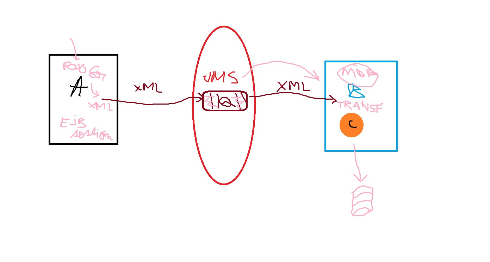

# jms-practice-apps

Practice JMS between two Java EE applications.

### Masterplan



### Setup

1. The app will be deployed to a local `JBoss Wildfly 24.0.1.Final` application server.

2. The message broker is `Apache ActiveMQ` provided by Wildfly (internal topology of the JMS provider). The JMS component 
   is activated only if you run the application server with the `full` profile (use `standalone-full.xml` configuration) 
   when starting it:

   ```bash
   # from WILDFLY_HOME\bin
   $ standalone.bat -c standalone-full.xml
   ```
   
3. Create JMS queues or topics using JBoss Wildfly CLI:

   ```bash
   # ./jboss-cli.sh
   $ jms-queue add --queue-address=myQueue --entries=queue/myQueue,java:jboss/exported/jms/queue/myQueue
   # check if queue was created
   $ /subsystem=messaging-activemq/server=default/jms-queue=myQueue:read-resource
   ```
   Presently there are 2 queues: 
      - `myQueue` which contains Car objects as XML
      - `stringQueue` which contains text messages
4. Deploy app to application server using Maven Wildfly plugin. Other options are possible.

   ```bash
   $ mvn wildfly:deploy -Dforce=true
   ```
   